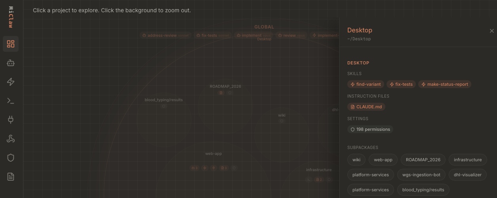

<h1 align="center">MiClaw</h1>

<p align="center">
  
</p>

<p align="center">A local dashboard that visualizes your Claude Code configuration.</p>

<p align="center">
  
</p>

## Overview

MiClaw scans your `~/.claude/` directory and project-level configuration files to present a unified view of how Claude Code is set up on your machine. It surfaces agents, skills, slash commands, MCP servers, hooks, settings, permissions, keybindings, and instruction files -- all read-only, no writes, no network calls.

## Features

- Interactive circle-pack visualization of your entire Claude Code configuration
- Per-project configuration breakdowns with file tree views
- Agent and skill inspection with YAML frontmatter parsing
- MCP server listing and status display
- Hook and command registry browsing
- Settings priority chain visualization (global, project, user overrides)
- Permission and keybinding summaries
- Instruction file (CLAUDE.md / AGENTS.md / .clauderules) rendering

## Getting Started

### Prerequisites

- [Node.js](https://nodejs.org/) v20+ or [Bun](https://bun.sh/) (recommended)

### Install and run

```bash
# Clone the repo
git clone <repo-url> && cd MiClaw

# Install dependencies
bun install

# Start the dev server
bun run dev
```

Open [http://localhost:3000](http://localhost:3000) in your browser.